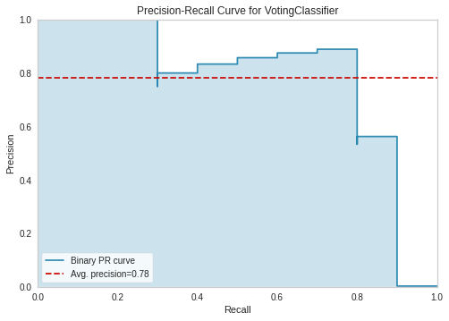
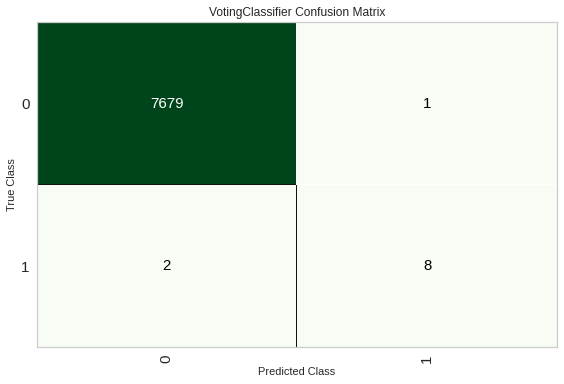
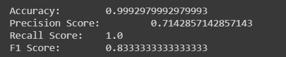

## Github repo:

[MLOps_Assignment](https://github.com/sanidhyaanand/MLOps_Assignment/tree/pycaret_expt1)

## List of preprocessing and feature engineering techniques
- fix imbalance
- ignore unimportant features

## F1 scores before and after fine tuning
| Model | Before tuning | After tuning |
|-------|---------|--------|
| Extra Trees Classifier | 0.76 | 0.68 |
| Random Forest Classifier | 0.75 | 0.72 |
| Light Gradient Boosting Machine | 0.67 | 0.74 |
| Gradient Boosting Classifier | 0.68 | 0.75 |
| K Neighbors Classifier | 0.46 | 0.62 |

## Precision-Recall Plot & the Confusion Matrix

## Accuracy, Precision, recall & F1-Scores

